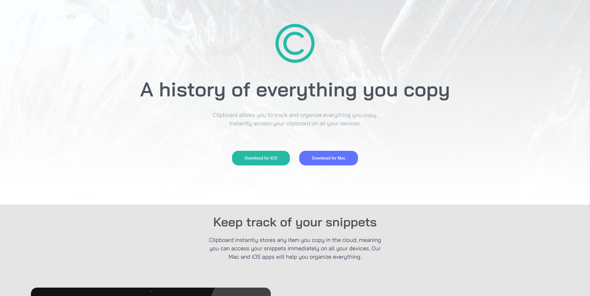
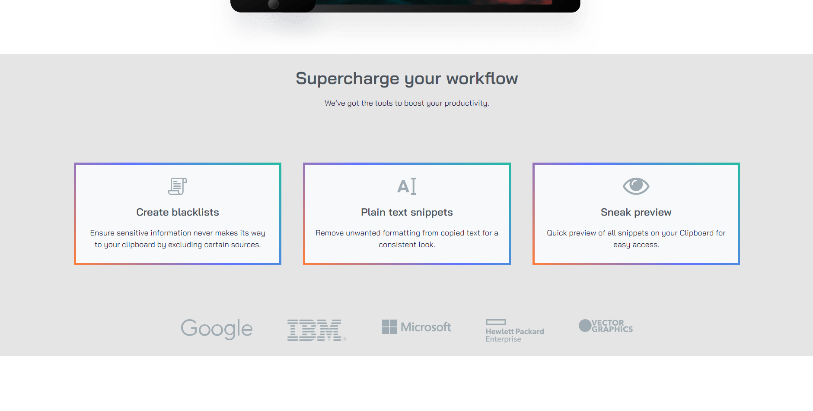

# Frontend Mentor - Clipboard landing page solution

This is a solution to the [Clipboard landing page challenge on Frontend Mentor](https://www.frontendmentor.io/challenges/clipboard-landing-page-5cc9bccd6c4c91111378ecb9).

## Table of contents

- [Overview](#overview)
  - [The challenge](#the-challenge)
  - [Screenshot](#screenshot)
  - [Links](#links)
- [My process](#my-process)
  - [Built with](#built-with)
  - [What I learned](#what-i-learned)
  - [Continued development](#continued-development)
  

## Overview
  Designing a clipboard landing page 

### The challenge

Users should be able to:

- View the optimal layout for the site depending on their device's screen size
- See hover states for all interactive elements on the page

### Screenshot





### Links

- Solution URL (via Github): https://github.com/Jud1th1/Clipping-Landing-page
- Live Site URL (via Netlify): https://clipboardlanding-judith.netlify.app/ 

## My process
- Built desktop first by using grid and flex
- Formatted my html layout, added a stylesheet with colors and fonts according to the design sheet
- Worked through the CSS from top to bottom then added media queries for 600px max

### Built with

- Semantic HTML5 markup
- CSS custom properties
- Flexbox
- CSS Grid
- Desktop-first workflow


### What I learned

I had trouble with my media query and realized that I was setting a fixed width which was making my grid unresponsive when shrinking. Also I think starting from a mobile first design would have been benefical and easier in this practice. 


```css
.wrkflow{
    border: 5px solid;
    border-image: linear-gradient(45deg,#FD7E3D, hsl(233, 100%, 69%),  hsl(171, 66%, 44%)) 1;
    background-color: #f8f9fa;
    padding-top: 30px;
    padding-bottom: 30px;
}
```

### Continued development

- Practice repsonsive grid design/layout
- Media queries

